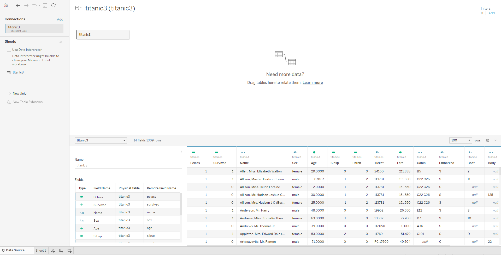
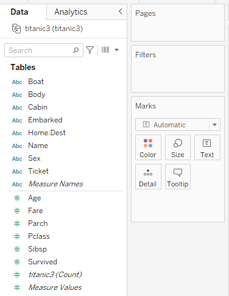
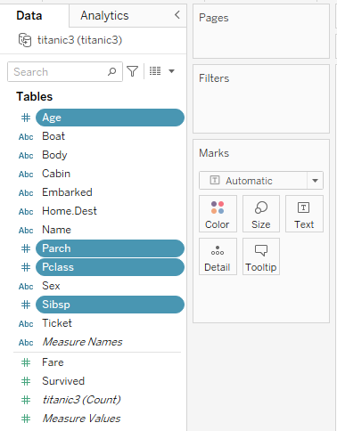
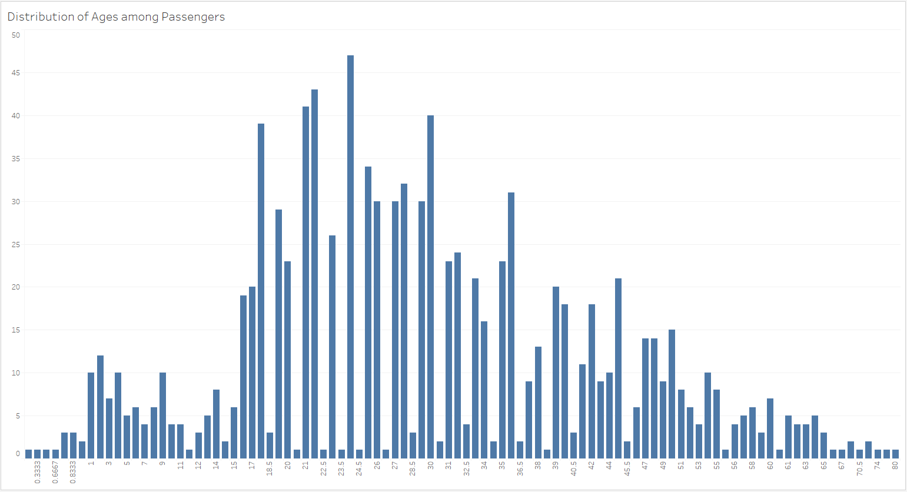
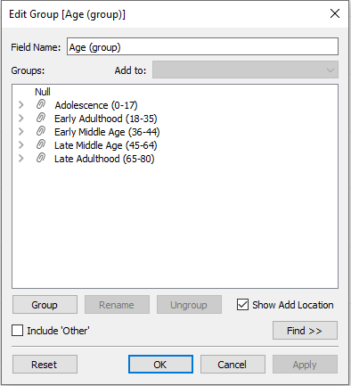

# Tragedy at Sea: Analyzing Titanic Passenger Data

## Resources
Data source: titanic3.xls

Software: Tableau Desktop Public Edition Version 2023.1

## Project Objective
### Use the provided data to create a dashboard to tell the best possible data driven story.

## Processing and Visualization
After inspecting the csv file, I connected it to Tableau as an Excel file. 

Next, I reviewed the measures and dimensions and noticed that some of them were categorized incorrectly. The image on the left is the before and the image on the right is the after.

   

The histogram illustrates the distribution of passenger ages in the dataset. The majority of passengers fall in the 18 to 35 age range.

Since there were a wide range of ages in the dataset, I decided to group them into specific ranges.

### Please watch the video below demonstrating how to navigate the dashboard

<iframe width="980" height="500" src="https://www.youtube.com/embed/pBy1zgt0XPc" title="YouTube video player" frameborder="0" allow="accelerometer; autoplay; clipboard-write; encrypted-media; gyroscope; picture-in-picture; web-share" allowfullscreen></iframe>

<a href="https://public.tableau.com/views/TragedyatSeaAnalyzingTitanicPassengerData/Dashboard1?:language=en-US&:display_count=n&:origin=viz_share_link" target="_blank">View the Dashboard on Tableau Public</a>

## Drawing Insights

1. There were 1,309 total passengers on the Titanic, not including the 900+ crew members.
2. The age group with the highest representation among passengers were those between 18 and 35, accounting for 43.5% of the total passenger count.
2. The average age and fare across all passengers was 29.9 years old and $33.30.
3. The majority of the passengers were third-class males from Southampton, England in the United Kingdom, many of whom were traveling alone or were single.
4. It appears that passengers in age groups 0-17 and 45-64 had higher average survival rates, possibly because they included children and parents who were prioritized for rescue. In contrast, age groups 18-35 and 36-44 had lower average survival rates, likely due to the higher proportion of third-class single males among these age ranges. It is worth noting that the average survival rate for the 65-80 age range may be unreliable, as this group represents only 1% of the total passengers.

---
Return to the [Homepage](https://kenlo94.github.io/)
